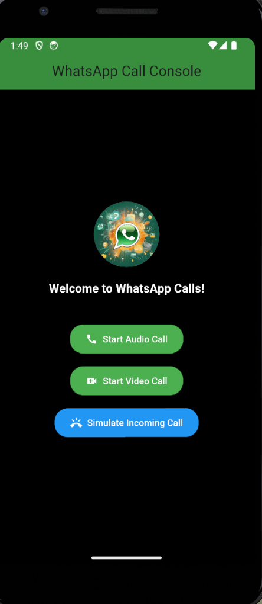
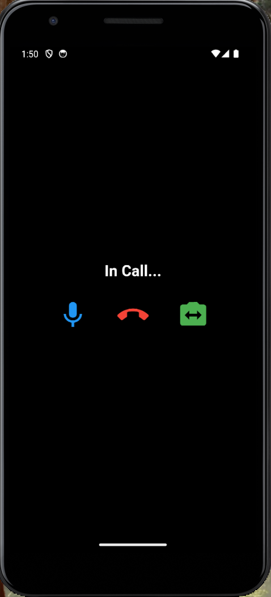
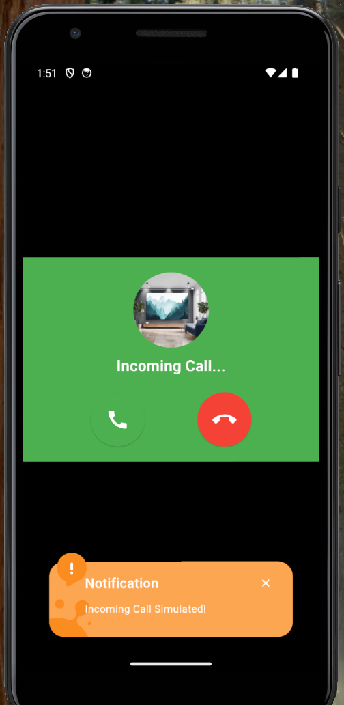
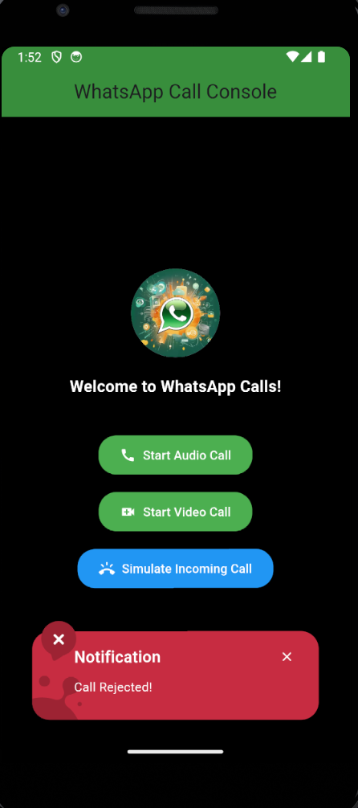

# **WhatsApp-Like Call Console**

A Flutter application simulating WhatsApp-like audio and video calls with basic features, including starting calls, handling incoming calls, and in-call controls.

---

## **Features**
- **Idle State**: Buttons to start audio or video calls and simulate an incoming call.
- **Incoming Call Screen**:
  - Displays a prompt with a user avatar and options to **Accept** or **Reject** the call.
- **In-Call Screen**:
  - Video feed placeholder.
  - Controls to **Mute**, **End Call**, and **Switch Camera**.
- **WhatsApp-Like UI**:
  - Green and white color scheme with rounded buttons and modern styling.
- **Enhanced Feedback**:
  - Visual snackbars using `awesome_snackbar_content` for user actions.

---

## **Screenshots**
### Idle State


### Incoming Call Screen


### In-Call Screen


### Simulate Call Screen



## **Steps to Run the App**

1. **Clone the Repository**:
   ```bash
   git clone <repository-url>
   cd <repository-folder>
   ```

2. **Install Dependencies**:
   Run the following command to fetch all required dependencies:
   ```bash
   flutter pub get
   ```

3. **Set Up Assets**:
   Ensure the following files are in the `assets/images` folder:
   - `whatsapp.webp` (default avatar image)
   - `play_video.png` (video feed placeholder image)

   Update the `pubspec.yaml` file:
   ```yaml
   flutter:
     assets:
       - assets/images/play_video.png
       - assets/images/whatsapp.webp
   ```

4. **Run the App**:
   Use the Flutter CLI to launch the app:
   ```bash
   flutter run
   ```

   - Ensure you have an emulator or a connected device.

---

## **Project File Structure**
```plaintext
lib/
├── main.dart                      # Entry point of the app
├── models/
│   └── call_state.dart            # Enum for managing call states
├── screens/
│   └── call_screen.dart           # Main screen handling all call interactions
├── utils/
│   └── state_manager.dart         # State management for call actions
├── widgets/
│   ├── call_action_buttons.dart   # Buttons for in-call actions
│   └── incoming_call_prompt.dart  # Incoming call UI prompt
```

---

## **Dependencies**
- **`provider`**: State management.
- **`awesome_snackbar_content`**: Enhanced visual snackbars for user feedback.

---

## **Summary of Implemented Features**
1. **Call State Management**:
   - Idle → Ringing → In-Call → Call Ended
2. **UI Features**:
   - WhatsApp-like design with rounded buttons and avatars.
   - Full-screen video feed placeholder during in-call state.
3. **Enhanced User Feedback**:
   - Informative and visually appealing snackbars for all actions.
4. **User Actions**:
   - Start Audio/Video Calls.
   - Handle Incoming Calls (Accept/Reject).
   - In-Call Controls (Mute, End Call, Switch Camera).

---

## **Contributing**
Feel free to open issues or contribute to this project by submitting pull requests.

---

## **License**
This project is licensed under the [MIT License](LICENSE).

---

## **Contact**
For any queries, please contact:
- **Email**: [shivamshakya2111@gmail.com.com]

